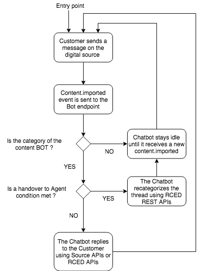

# Microsoft - Chatbot Integration walkthroughs

 
## Table of contents


**[RingCentral Engage Digital console setup](#rc-engage-digital-console-setup)**

**[Full API chatbot integration (works for any RingCentral Engage Digital Source)](#full-api-chatbot-integration-works-for-any-ringcentral-engage-digital-source)**

- [Standard Flow and principle](#standard-flow-and-principle)

- [Walkthrough](#walkthrough)
    
    - [Case 1: The bot has successfully processed the customer request](#case-1-the-bot-has-successfully-processed-the-customer-request)

    - [Case 2: A bot to Agent (human) handover condition is met](#case-2-a-bot-to-agent-handover-condition-is-met)

- [Intervention reopening](#intervention-reopening)
    
    - [Case 1: On intervention.reopened, the live agent handles the first level of support](#case-1-on-interventionreopened-the-live-agent-handles-the-first-level-of-support)

    - [Case 2: On intervention.reopened, the bot handles the first level of support](#case-2-on-interventionreopened-the-bot-handles-the-first-level-of-support)   

**[Emergency Handover to Agents
process](#emergency-handover-to-agents-process)**

- [Manually deactivate bot and/or bot responses](#manually-deactivate-bot-andor-bot-responses)

- [Deactivate bot connected sources default categorization](#deactivate-bot-connected-sources-default-categorization)

- [Create an Emergency Handover rule](#create-an-emergency-handover-rule)

- [Activate Emergency Handover rule](#activate-emergency-handover-rule)

**[Glossary](#glossary)**

 
## RingCentral Engage Digital Console setup

-   **PLATFORM:** Url of your RingCentral Engage Digital console

-   **API_ENDPOINT:** Url of your dedicated API endpoint

-   **API_ACCESS_TOKEN:** API token for the realtime endpoint URL

-   **DIMELO_SOURCE_ID:** ID of the channel that you want to connect to the bot

-   **Handover categories:**

    - **BOT_CATEGORY_ID:** ID of the category used to route messages to bot agent.  No human agent has this category/skill and cannot answer to the threads categorized as bot

    - **AGENT_CATEGORY_ID:** ID of the category used to route messages to real agents after a handover process.  All human agents needing to answer customer messages after the chatbot will have this category/skill so they can answer the messages following the handover from the bot to the agents

If you want Agents to test, you would need to give them permissions over the relevent source (at least `READ` and `REPLY`) and give them the `AGENT_CATEGORY` skill/category.


____

As a console admin, you can invite new agents on your platform by putting their mail address and providing some basic contact details.

____
 
The source will need to be in a topology where the `anyone` step is at 0. If not, agents will receive bot messages once a bot task reaches this step.

____

## Full API chatbot integration (for any RingCentral Engage Digital source)

### Standard Flow and principle

<center></center>


### Walkthrough

-   Customer contacts the brand on any bot connected source

-   RingCentral Engage Digital receives the customer message on the source

-   The first customer message is automatically categorized by RingCentral Engage Digital as `BOT_CATEGORY` by the Source default categorization. The handover and request processing will be based on the content category.

-   The bot or proxy app receives a webhook event **content.imported** with the following payload:

```json
{
    "id": "1e047f0fc947a3da736a65b2",
    "domain_id": "582af25a799fc247acfcde38",
    "events": [
    {
        "type": "content.imported",
        "id": "5be5aeffe203116daf064709",
        "issued_at": "2018-11-09T15:59:59.770Z",
        "resource":
        {
            "type": "chat/message",
            "id": "5be5aeffd6cb009bde8e56e2", // Message ID in RingCentral Engage Digital
            "metadata":
            {
                "approval_required": false,
                "author_id": "5b8eaf1813047d298f940265",
                "body": "I don't know",
                "body_input_format": "text",
                "creator_id": nil,
                "date": "2018-11-09",
                "first_in_thread": true,
                "foreign_categories": [],
	            "category_ids": [
		            "5bdcb766799fc227748f4453", //Other existing category
                    "5be59e0a13047d01f46caa62" //BOT_CATEGORY_ID
                ],
                "foreign_id": "223cea8921c616e560b24d1f",
                "has_attachment": false,
                "intervention_id": nil,
                "in_reply_to_author_id": nil,
                "in_reply_to_id": nil,
                "language": "fr",
                "source_id": "5b3b6562d6cb00f93fe59c9f",
                "status": "assigned",
                "thread_id": "5be5ae57d6cb009bde8e5674",
                "thread_title": "salut",
                "created_from": "synchronizer",
                "private": true
            }
        }
    }]
}
```

-   [**Optional**] in case you want more accurate statistics about the bot processing. The bot opens an intervention (required if you want to send a survey after the intervention is closed for a bot only processing) using RingCentral Engage Digital REST API.  See https://developers.ringcentral.com/engage/api-reference/Interventions/getIntervention

    -   HTTP POST: `https://API_ENDPOINT/interventions?access_token=API_ACCESS_TOKEN`
        
    -   Providing the following parameter:
        -   **resource.id** (Message ID) in RingCentral Engage Digital (in the **content.imported** payload)

    -   The response payload will look like:

    ```json
    {
        "id": "3f55c8330da4144afd1c6728", // Intervention technical ID that will be necessary to close it afterwards
        "created_at": "2012-05-21T01:15:28Z",
        "updated_at": "2012-05-21T01:19:49Z",
        "source_id": "f18c81948c137d86dac77216",
        "thread_id": "9c9903dc3d559a8801eb5441",
        "content_id": "c93e3586250ff60181b6c2f0",
        "deferred_at": "2012-05-21T01:18:49Z",
        "identity_id": "8a8deed44623a4c44268c266",
        "comments_count": 1,
        "closed": false,
        "closed_at": "2012-05-24T02:00:32Z",
        "custom_fields": {
                "external_id": "342901"
        },
        "category_ids": 
        [
            "4d0fb475b242228032cbdf6d", 
            "59248c4dae276a021cb296d2"
        ],
        "user_id": "d033e22ae348feb5660fc214",
        "user_replies_count": 1,
        "user_reply_in_average": 84959,
        "user_reply_in_average_bh": 63000,
        "user_reply_in_average_count": 1,
        "first_user_reply_id": "573446514379728247000001",
        "first_user_reply_in": 0,
        "first_user_reply_in_bh": 0,
        "last_user_reply_in": 0,
        "last_user_reply_in_bh": 0,
        "status": "Fermée"
    }
    ```

____

Opening the intervention is only necessary for customer messages without intervention_id (intervention_id: nil) and first_in_thread (first_in_thread: true).

____

  -   The bot posts its answer using RingCentral Engage Digital REST API

    -   HTTP POST: `https://API_ENDPOINT/contents?access_token=API_ACCESS_TOKEN`
        
    -   Providing the following parameters:

        -  **author_id:** The identity id of content. This parameter is not mandatory, by default it use the token's user first identity on source.

        -   **body:** The content's body. This parameter is mandatory.

        -   **in_reply_to_id:** The content's id you want to reply to. If omitted, a new discussion will be created. If source does not support to initiate discussion this parameter is mandatory.

        -   **private:** Created contents are public by default, set this parameter to `1` in order to create a private reply.

        -   **source_id:** The source to create content to. If you specify in_reply_to_id parameter, source will be determined from. Otherwise, this parameter is mandatory.

-   Example:  `curl -X POST -d "source_id=5b3b6562d6cb00f93fe59c9f&in_reply_to_id=5be5aeffd6cb009bde8e56e2&body=”Bot Answer to the Customer message” "https://API_ENDPOINT/contents?access_token=API_ACCESS_TOKEN"`

-   RingCentral Engage Digital posts the message automatically on the concerned source

-   Repeat previous steps until a handover condition from bot to Agent is met or the bot has successfully processed the customers' requests.

____
 
You can create and close Interventions using the RingCentral Engage Digital REST API to get more accurate statistics about requests processed by the chatbot

____

#### Case 1: The bot has successfully processed the customer request

-   [**Optional**] in case you want more accurate statistics about the bot processing. The bot closes the intervention previously opened via REST API.

    -   HTTP PUT: `https://API_ENDPOINT/interventions/3f55c8330da4144afd1c6728/close?access_token=API_ACCESS_TOKEN`

    -   Please note that the following has to be verified in order to close an intervention otherwise a 403 will be raised:

        -   The Intervention MUST NOT already be closed

        -   The Intervention MUST have agent replies (that is why the intervention must be opened before the first BOT message)

        -   Access-Token agent MUST be the owner of the intervention or have the permission to edit permissions (as the Bot opened the intervention via REST API, the Bot will be the Intervention owner)

        -   Access-Token agent MUST have read access on the source

#### Case 2: A bot to Agent handover condition is met

The bot or proxy app has the content categories from the **content.imported** webhook event payload:

```
{
    "id": "1e047f0fc947a3da736a65b2",
    "domain_id": "582af25a799fc247acfcde38",
    "events": [
    {
        "type": "content.imported",
        "id": "5be5aeffe203116daf064709",
        "issued_at": "2018-11-09T15:59:59.770Z",
        "resource":
        {
            "type": "chat/message",
            "id": "5be5aeffd6cb009bde8e56e2", // Message ID in RingCentral Engage Digital
            "metadata":
            {
                "approval_required": false,
                "author_id": "5b8eaf1813047d298f940265",
                "body": "I don't know",
                "body_input_format": "text",
                "creator_id": nil,
                "date": "2018-11-09",
                "first_in_thread": true,
                "foreign_categories": [],
                "category_ids": 
                [
                    "5bdcb766799fc227748f4453", // Other existing category
                    "5be59e0a13047d01f46caa62" // BOT_CATEGORY_ID
                ],
                "foreign_id": "223cea8921c616e560b24d1f",
                "has_attachment": false,
                "intervention_id": nil,
                "in_reply_to_author_id": nil,
                "in_reply_to_id": nil,
                "language": "fr",
                "source_id": "5b3b6562d6cb00f93fe59c9f",
                "status": "assigned",
                "thread_id": "5be5ae57d6cb009bde8e5674",
                "thread_title": "salut",
                "created_from": "synchronizer",
                "private": true
            }
        }
    }]
}
```

-   Now that the bot or proxy app has the existing thread categories, the idea is to change only the Chatbot Handover category from **BOT** to **AGENT**

    -   The new categories would be all existing ones without the BOT category and with the AGENT category

-   The bot or proxy app makes a REST API call using the thread ID in order to update the thread categories and provoke the task dispatch to human agents in RingCentral Engage Digital

    -   HTTP PUT: `https://API_ENDPOINT/content_threads/THREAD_ID/update_categories?access_token=API_ACCESS_TOKEN&thread_category_ids[]=EXISTING_THREAD_CATEGORY&thread_category_ids[]=AGENT_CATEGORY`

    -  In the example, the thread has 3 categories: `5bdcb766799fc227748f4453` (other category) and `5be59e0a13047d01f46caa62` (BOT Handover Category)

    -   The new categories would be `5bdcb766799fc227748f4453` (the other existing category) and `5be59e1f13047d026b6ca8af` (AGENT Handover Category)

    -   Example: `https://API_ENDPOINT/content_threads/5be1d047e20311250379c2f6/update_categories?access_token=API_ACCESS_TOKEN&thread_category_ids[]=5bdcb766799fc227748f4453&thread_category_ids[]=5be59e1f13047d026b6ca8af`

    -   The response payload will look like:
    ```
    {
        id: "5be1d047e20311250379c2f6",
        created_at: "2018-11-06T17:32:54Z",
        updated_at: "2018-11-07T09:30:39Z",
        category_ids: 
        [
        "5bdcb766799fc227748f4453",
        "5bdcba2ed6cb00362663b2b5"
        ],
        closed: false,
        contents_count: 1,
        extra_data: { },
        foreign_id: null,
        interventions_count: 0,
        source_id: "57d6d2b714bf8a83311decc9",
        thread_category_ids: 
        [
            "5bdcb766799fc227748f4453", // Other existing category
            "5be59e1f13047d026b6ca8af", // AGENT Handover Category
        ],
        title: "Hello, I am following up on a post I wrote just now. I am interested in a wearable device for running, cycling and swimming, Do you guys...",
        last_content_at: "2018-11-06T17:32:54Z"
    }
    ```

-   The bot stops answering the messages. You will still receive all **content.imported** events.

    -   The bot will now only wait to new **content.imported** Payloads where the category is **BOT_CATEGORY_ID**

-   The task will be proposed to agents with the AGENT skill (should be all agents on the chatbot connected source)

-   **[Optional]** if the bot must handle intervention reopening, see below.  Once the intervention is completed by the agent, **intervention.closed** will be fired to the endpoint of your choosing with the following information:

    -   Note: Human agents should not complete tasks with every message they sent ( and use the defer function instead), because else **intervention.closed** will be fired every time they complete a task

    ```
    { 
    "id": "bd13a9d9baa8c20cf93046cd",
    "domain_id": 1,
    "events": [{
        "type": "intervention.closed",
        "id": "70d340997b8cd2c6f4dfee22",
        "user_id": "4f4f3a08a90ffb27ee000583",
        "resource": {
        "type": "intervention",
        "id": "5464b5c04d61639684110000",
        "metadata": {
            "custom_field_values": {
            "sample_field": nil
            },
            "category_ids": ["4f3951557aa58d1462017a8f", "50895dbea90ffb3c35001ace"],
            "closed_at": nil,
            "deferred_at": nil,
            "identity_id": "557f003c7765620fdc0002cc",
            "source_id": "56178fd27765625e06000a66",
            <b>"thread_id": "565739986b65795289000029",</b>
            "user_id": "52fcf5157aa58dd768000006"
        }
        },
        "issued_at": "2014-02-10T18:35:35.251Z"
    }]
    }
    ```

### Intervention reopening
An intervention can be reopened if the customer contacts the brand just after the intervention is closed. It will trigger an **intervention.reopened** webhook event. It's your choice to either let the agent handle first the communication (No need for thread categorisation) or direct the customer immediately back to the bot (Need to recategorize the thread just after the intervention is closed).

**Business team will need to decide how you want this case to be handled**

____

You can also choose to block the possibility to reopen the intervention by closing the thread via the REST API once the intervention is closed.

____

Please find below the walkthrough for both cases

#### Case 1: On intervention.reopened, the live agent handles the first level of support 

-   New Customer messages will reopen the intervention but contents will still be categorized as AGENT so the Bot will receive **content.imported** events with the AGENT category which it should not reply to.

-   The agent will receive the new task as the content is still categorized as AGENT

-   The agent maintains the conversation with the customer and processes the Customer's requests

-   When the agent completes the task, **intervention.closed** event is fired again

-   If the next customer message is received after the source Thread Inclusion Delay (defined in the source configuration screen in RingCentral Engage Digital)

#### Case 2: On intervention.reopened, the bot handles the first level of support 

-   Here, the thread should be categorized as BOT when the intervention closes

-   After receiving the **intervention.closed** event payload, the bot categorises the thread as BOT using REST APIs.

    - Replace the AGENT category by the BOT category
    
    - HTTP PUT: `https://API_ENDPOINT/content_threads/THREAD_ID/update_categories?access_token=API_ACCESS_TOKEN&thread_category_ids[]=EXISTING_CATEGORY_ID&thread_category_ids[]=BOT_CATEGORY_ID`

***NOTE***    
    You will get the content category from the last **content.imported** event payload that you will receive before the **intervention.close** event.
                                                          
-   The bot should be reactivated and should handle the first level of communication again

-   The conversation follows the same process like before the first handover

## Emergency Handover to Agents process

### Manually deactivate bot and/or bot responses

See with the bot partner how to do it autonomously.

### Deactivate bot connected sources default categorization 

With a RingCentral Engage Digital Administrator account:

-   Go to **Admin/Sources**

-   Double click the concerned source

-   In **Default categories** field, remove the **"BOT"** Handover category

-   In **Default categories** field, add the **"AGENT"** Handover category

-   Click **"Save"** at the bottom of the page

New messages on new threads will be categorized as AGENT so Agents can process them directly.

### Create an Emergency Handover rule 

With a RingCentral Engage Digital Administrator account:

-   Go to **Admin/Rules engine**

-   Click on the top right add button to create a new rule

-   Apply the following configuration:

    -   **Active:** No - Don't activate the rule by default, this rule must be activated only in case of emergency

    -   **Label:** EMERGENCY - Handover to Agents

    -   **Action:** Categorize thread

    -   **Assign categories:** AGENT_CATEGORY

    -   **Recategorize:** YES

    -   **Only for sources:** Just add source concerning by the bot integration

    -   **Match type:** Category

    -   **Match category:** BOT_CATEGORY

-   Click "**Save**" at the bottom of the page

### Activate Emergency Handover rule 

With a RingCentral Engage Digital Administrator account:

-   Go to **Admin/Rules engine**

-   Double click the "**EMERGENCY - Handover to Agents**"

-   Check "**Activate**"

-   Click "**Save**" at the bottom of the page

Existing Bot conversations will be forcefully recategorized as AGENT (handover category).

## Glossary

**Agent**

User of RingCentral Engage Digital.

**Customer**

End user who contact the brand by a customer care channel.

**Assign**

Action of choosing among the agents who will process the message. To assign a message to yourself, see Engage.

**Category**

Label used to identify a reason for contact (message/intervention/thread) or a skill (agent) and to dispatch the message efficiently, or qualify it after it's been processed (post qualification).

- Parent category: category, choosable or not, under which several subcategories can be gathered.

- Subcategory: depends on a Parent category.

**Channel**

Section where all the sources are gathered, if they're added in the Push mode, for one branch of the topology. In order for a source to be in the Task view, it has to be added in a channel. The default channels are Async and Realtime.

**Engage**

Action of self-assigning a message in order to reply. Option that is available when the mouse is over a message.

**Intervention**

Group of messages between only one customer and an agent in the same thread.

**Message**

Public or private content written by an agent or a customer. The message can turn into an intervention and displays a status (New, Assigned, Replied, Ignored, Agent reply, Agent message).

**Routing**

Tasks dispatch, according to permissions and skills (languages and categories) that are configured for the agents, and following the steps in the topology.

**Rule**

Action (ignore, categorize, update priority of a task...) that is to be applied under one or several conditions, and programmed in the Rules engine.

**Rules engine**

Extension that enables to proceed automatic actions when a message is imported (categorize, ignore, put a priority boost) based on specific conditions (Text search, status of the message, business hours...).

**Source**

Account linked to RingCentral Engage Digital to synchronize the messages (Twitter thread, Facebook Wall, email address, Chat, Dimelo Mobile etc.). The Source section of the Admin enables to configure the accounts accesses and to check the state of the source synchronization.

**Survey**

Satisfaction poll sent to a customer when the intervention is closed.

**Task**

Only in the Tasks view, messages that are dispatched according to skills (language, categories) and await for an action from the agent (reply, ignore, transfer).

**Thread**

A thread is composed of messages that are chronologically sorted (the oldest on top). A thread can be compound of public and/or private messages written by different customers. A thread includes messages from customers and replies from agents. The messages written by the customers follow a life cycle.

**Token**

Password made of an alphanumeric row. It is required to connect some sources and to authorize the synchronization of the messages.

**Topology**

Matrix representing the workflow of the tasks that are dispatched following different steps. Every steps have a customizable expiry delay and are based on business.