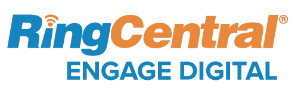

# WhatsApp onboarding process

## Table of contents

**[Objectives](#objectives)**

**[Requested elements](#requested-elements)**

- [Facebook Business ID](#facebook-business-id)

- [Verified Name](#verified-name)

- [Phone number](#phone-number)

- [HSM templates](#hsm-templates)

- [Profil information](#profil-information)

- [Line of Credit](#line-of-credit)

**[Engage Digital configuration](#engage-digital-configuration)**

- [Step 1 - Create Customer WhatsApp Business account](#step-1-create-customer-whatsapp-business-account)

- [Step 2 - API hosting](#step-2-api-hosting)

- [Step 3 - Verification code](#step-3-verification-code)

- [Step 4 - HSM configuration](#step-4-hsm-configuration)

- [Step 5 - Business profile configuration](#step-5-business-profile-configuration)

**[How can customers contact you on WhatsApp?](#how-can-customers-contact-you-on-whatsapp)**

- [How to integrate the wa.me (click to chat) button on your website?](#how-to-integrate-the-wa.me-click-to-chat-button-on-your-website)

- [WhatsApp for Business Entry Points](#whatsapp-for-business-entry-points)

- [Contact Page](#contact-page)

- [Website/Footer](#website-footer)

- [App](#app)

- [IVR](#ivr)

- [Packaging](#packaging)

- [Google](#google)

- [Email signature](#email-signature)

**[Communication resources](#communication-resources)**

## Objectives

This document aims to present the expected elements in order to connect a WhatsApp account to Engage Digital.

To complete the setup, you must have an account on Facebook Business Manager and must be pre-qualified by WhatsApp.

## Requested elements

In order to connect your WhatsApp account to Engage Digital, you will have to send the following elements to your Project Manager:

-   Verified Name

-   Facebook Business Manager ID

-   Phone number

-   HSM templates

-   Profile information

-   Line of Credit

### Facebook Business ID

This is the ID linked to your official Brand account. It is available on Facebook Business Manager website.

It is a 15 digit number and you can find it in several places, including the URL of your Facebook Business access:

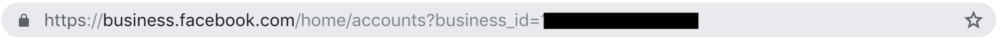

This ID must be sent to your project manager in order to connect your source to Engage Digital.

### Verified Name

The verified name (vname) is the name that appears for your business on WhatsApp. Depending on the type of business account your business has, the user will see this name appear in different places.

This name can not be modified.

This name can be created in your WhatsApp account in the Facebook Business Manager when you request a phone number.

### Phone number

Your WhatsApp account will be linked to a phone number dedicated to the company.

An authentication code will send on it so this number must receive phone calls and texts.

It can be a mobile or a landline phone number ex: +33 6 XX XX XX XX

Verification process is initiated on Engage Digital side: a verification code will be sent (text message) or given (phone call) on your phone number.

You will have to send back the code to Engage Digital project manager in order to finalize the connection.

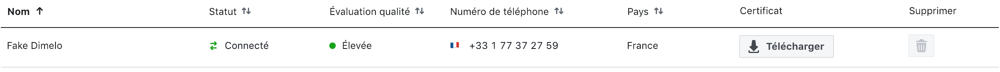

To generate the verification, you must create a WhatsApp source and set the following information:

-   Phone number

-   API URL (provided by Engage Digital Engineering team)

-   Certificate (see [Step1 - Create Customer WhatsApp Business
    account](#step-1-create-customer-whatsapp-business-account))

Then you can click on "Generate the verification code" and copy paste into the dedicated field as soon as you receive it (see details in [Engage Digital configuration](#engage-digital-configuration)).

**Note:** In order to receive the verification code, you have to synchronize with his project manager. Process has to be completed within one hour.

### HSM templates

Highly Structured Messages (HSM) are messages sent to customers when you want to answer back after a delay of 24 hours from last customer message.

WhatsApp doesn't allow classic message to be sent 24 hours or more after reception of the last customer message (in order to avoid spam, ads, etc\...).

In the case agent replies after 24h, the agent answers won't be sent (error message: synchronization fail)

Instead Engage Digital will send automatically an HSM to the customer.

Once the customer will have received the HSM and replied back, the agent's original message will be synchronized and sent to the customer.

Engage Digital recommends this type of HSM to encourage the customer to reply back.

This way agents replies will be sent if they were blocked by WhatsApp due to the 24 hours limit.

**ex:** *Hi, you contacted us about your account/savings/other, to receive our answer, please send us a message.*

**or**

*Hi, you contacted us on WhatsApp more than 24 hours ago. Have you ever received an answer to your question?*

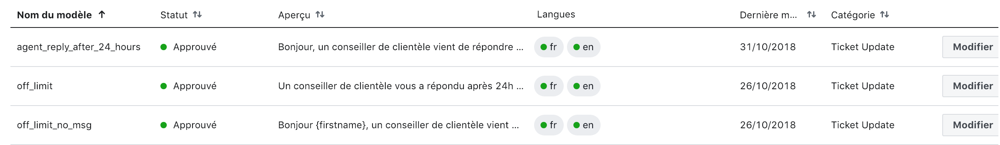

You can define several HSM and in different languages. When sending the HSM, WhatsApp will identify the language of the recipient WhatsApp account, and if a locale HSM has been submitted, that language will be used.

Every HSM needs to be approved by WhatsApp before it can be used.

### Profile information

As part of WhatsApp Business API offering, WhatsApp allow brands to apply for 'WhatsApp Verified Status' that enables the green check mark and displays the name of the brand when the phone number isn't stored.

From a process point of view, WhatsApp require the following details to initiate the verification process:

-   Provider Name: (Engage Digital)

-   Business Name:

    -   If the business is known under any other name:

    -   If the business name is in a language other than English:

    -   If this is a sub-brand, please include the name of the parent
        brand:

-   Phone number(s):

-   Website:

-   Link to Facebook Page if available:

-   Avatar (640x640px)

Engage Digital will be able to submit the customer account for review as soon as this information are provided by the customer.

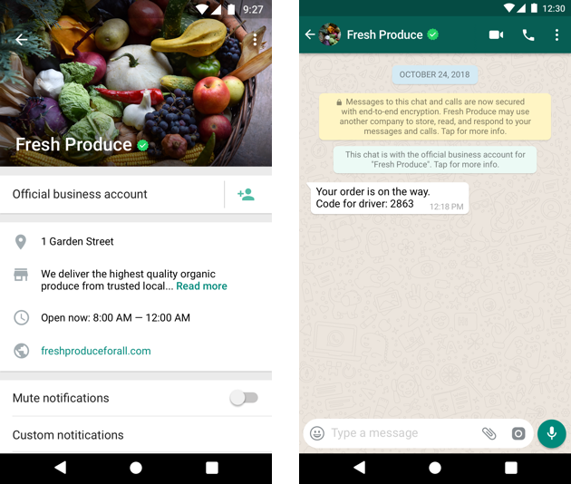

### Line of Credit

In order to allow Engage Digital to send HSM on your behalf, you have to approve Engage Digital on your Facebook Business Manager.

The path is: Business Manager \> Requests (left navigation pane) \> Approve Dimelo.

Once Engage Digital will be authorized by you, HSM will be sent from Engage Digital.

## Engage Digital configuration

### Step 1 - Create Customer WhatsApp Business account

In Facebook Business, Engage Digital has to create a new account for you. Requested elements are:

-   Phone number with country code

-   Business ID

-   Vname (Verified Name)

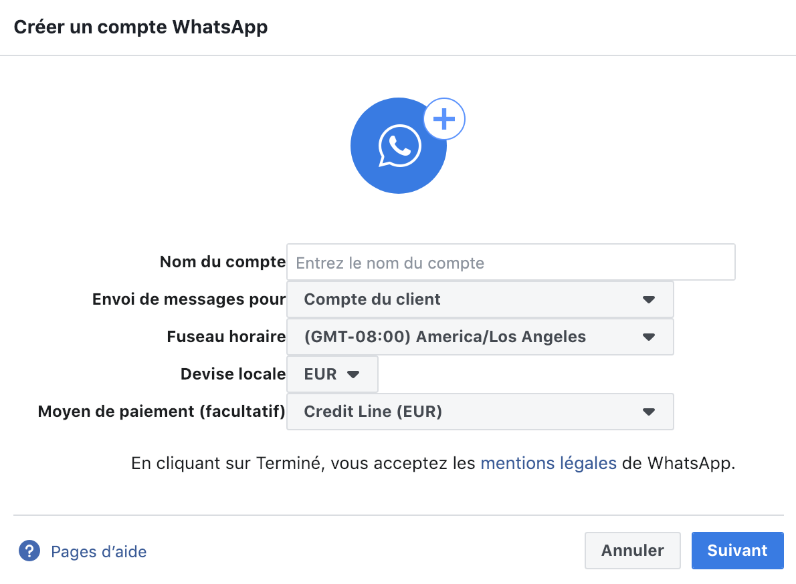

**A line of Credit (Engage Digital) has to be selected (even if it is indicated as optional).**

Then Engage Digital project manager can add the phone number:

Select the account \> Phone numbers \> Add a phone number

A popin opens and you can fill in the requested elements: vname and phone number + country code.

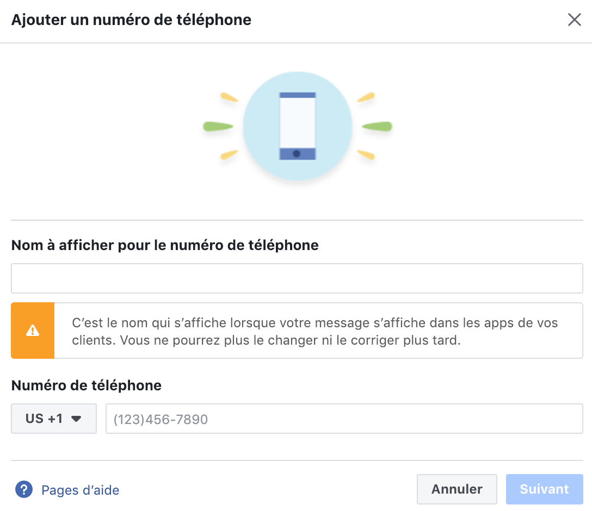

Once the form is completed a certificate will be generated.

**This certificate must be copied (or downloaded) as it will be requested to connect the account to Engage Digital.**

Then Engage Digital project manager can proceed to step 2.

### Step 2 - API hosting

A dedicated API hosting url has to be created by Engage Digital Engineering team.

Then the Engage Digital project manager can create the source on Engage Digital by adding:

-   Phone number and country code

-   API url

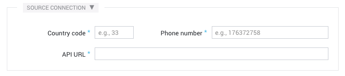

Engage Digital project manager will be able to move to step 3. A new button will be displayed in the administration of the source.

### Step 3 - Verification code

Then Engage Digital project manager can add into the source the certificate.

A new button will be displayed: he can click on the button "Get your register code" in Engage Digital interface.

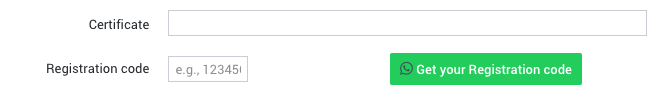

A flash message will appear confirming or not if the code was sent.

A call or a text message will be send on the phone number to the customer.

You will have to send back the code to Engage Digital in order to add it to the administration of the source in Engage Digital.

A new button will also appear **Verify your account**: Engage Digital project manager has to click on it.

A new flash message will indicates the success or not of the connection of the source.

Once the source is connected, the status of the phone number in Facebook Business will mode from **Offline** to **Connected**:

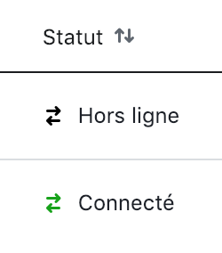

Once the phone number is synchronized, the two authentication factor is activated.

### Step 4 - HSM configuration

In order to configure the HSM, you will need the following elements from the Facebook Business Account created for the client:

-   Namespace,

-   Element name,

-   Body of the HSM for the different language

Only one message but in different languages can be configured in Engage Digital, without interpolation.

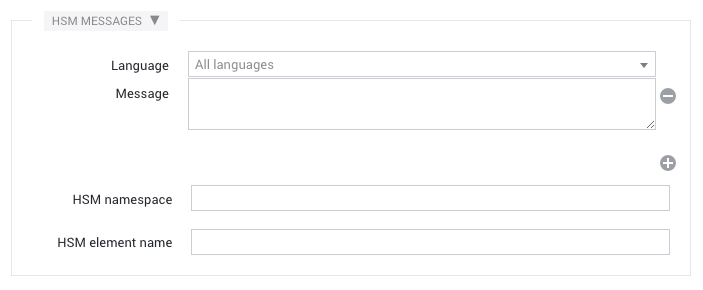

### Step 5 - Business profile configuration

These fields have to be completed based on the information shared by the client. It allows WhatsApp to perform a verification process for each account connected to Engage Digital.

The requested elements are:

-   Address

-   Description of the company

-   Contact email

-   Activity

-   Website(s)

-   About

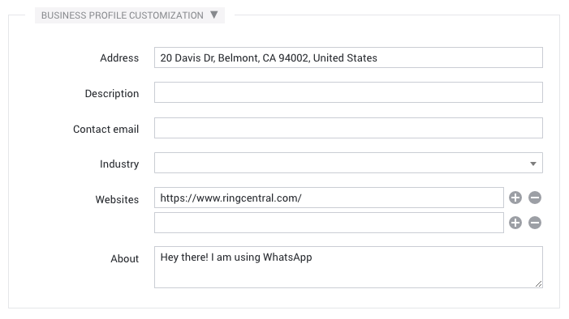

## How can customers contact you on WhatsApp?

You can be contacted on WhatsApp by your customers in 2 ways:

-   Phone number displayed by you on communication supports(website, leaflets, posters...). The customer adds the phone number and contacts you through the WhatsApp app.

-   Click to chat - Direct button displayed on your website (wa.me button). When clicking on the button, a WhatsApp for web conversation will open in your browser.

### How to integrate the wa.me (click to chat) button on your website?

The complete WhatsApp documentation on the wa.me button integration is available here:
[https://faq.whatsapp.com/en/android/26000030/](https://faq.whatsapp.com/en/android/26000030/).

The complete WhatsApp brand guidelines are available here: [https://whatsappbrand.com/](https://whatsappbrand.com/)

To create your WhatsApp click to chat button, use the format https://wa.me/\<number\> where the \<number\> is a full phone number in international format.

> Example, (French number): [https://wa.me/33142XXXXXX](https://wa.me/33142XXXXXX)

You will then need to integrate that link behind the appropriate and up-to-date WhatsApp button (see below: communication resources).

### WhatsApp for Business Entry Points

#### Contact Page

Good alternative to traditional mail form

The ultimate basics, mentioning the brand is reachable via WhatsApp is the minimum a brand can do.

ROI:

-   Brand image

-   Email reduction

#### Website / Footer

Easy for customer to contact you from any page

Floating triggered button that appears on key pages

Another basic, add the WhatsApp on the bottom of your website like you would add your phone number.

ROI:

-   Brand image

-   Sales conversion

-   CSAT

#### App

Build engagement from within the app

Users may want to contact you on WhatsApp from your app. Adding a WhatsApp entry point there is a great idea since you are reaching out to Mobile first users.

ROI:

-   Call deflection

-   CSAT

-   Branding

#### IVR

Reroute customers to social phone backlog

What if you could move from synchronous to asynchronous? Adding WhatsApp as a choice when people are calling is a great idea. No more dead-ends: the person who called can press let's say "5" to forward to WhatsApp. WhatsApp supports voice-messaging.

ROI:

-   Call deflection

-   CSAT

#### Packaging

Customers can engage without visiting the website

Create a continued experience between offline and online. Billboards, magazine, shops, product packaging labels, events, etc\...

ROI:

-   CSAT

-   Brand image

#### Google 

Immediate engagement from a Google search

Search engine results pages can be optimized to display some useful information. The Customer Journey often starts there and having WhatsApp as a possible way to initiate the conversation could be a great user experience

ROI:

-   Call deflection

-   CSAT

-   Branding

#### Email signature

When a customer receives a response from the contact center through email, there could be a link within the email body to continue this conversation through WhatsApp.

Redirect customers to a conversational alternative

ROI:

-   Email reduction

-   CSAT

-   Branding

## Communication resources

The Brand Guidelines are available on the WhatsApp website here, including the visual charter [https://whatsappbrand.com/](https://whatsappbrand.com/)

If you wish to release any press statement or communication regarding your new connector, you will need to run it first by the press team at WhatsApp. Contact [adrien.lemaire\@ringcentral.com](mailto:adrien.lemaire@ringcentral.com) to guide you through these steps.