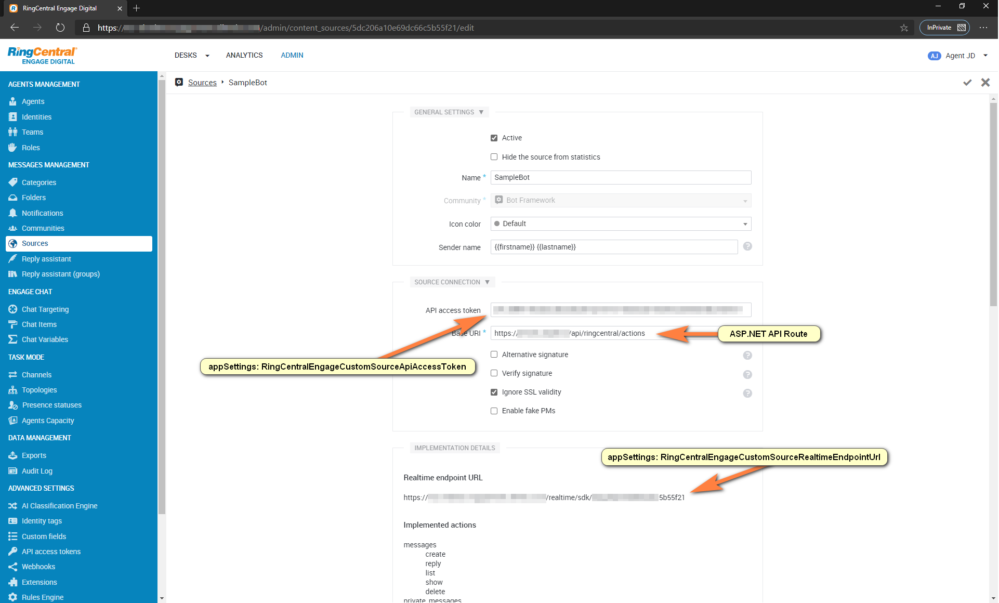
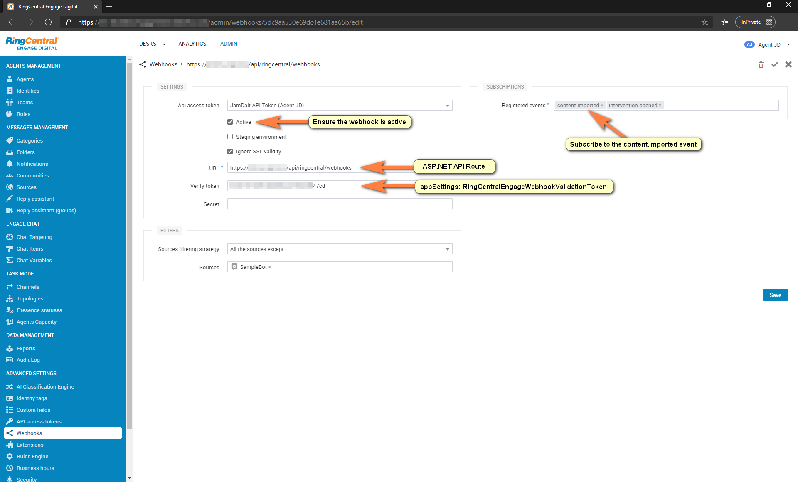
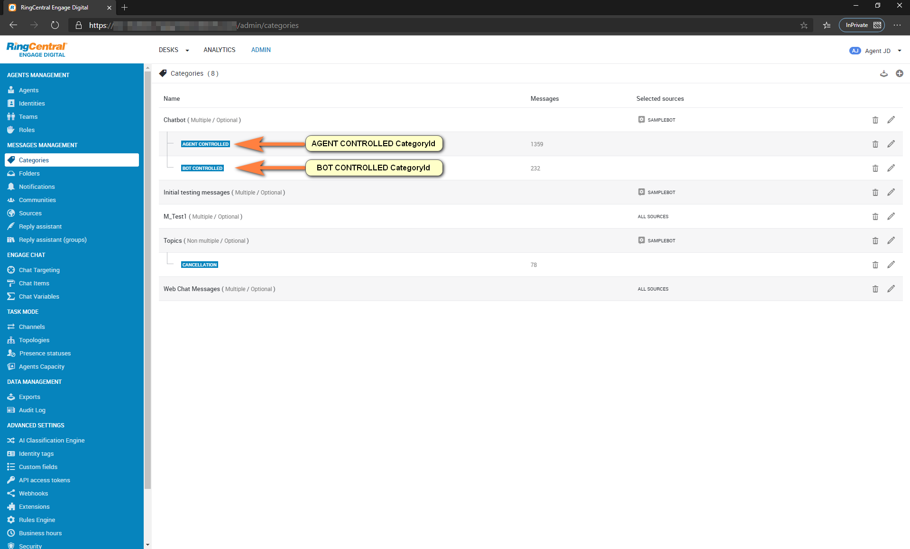
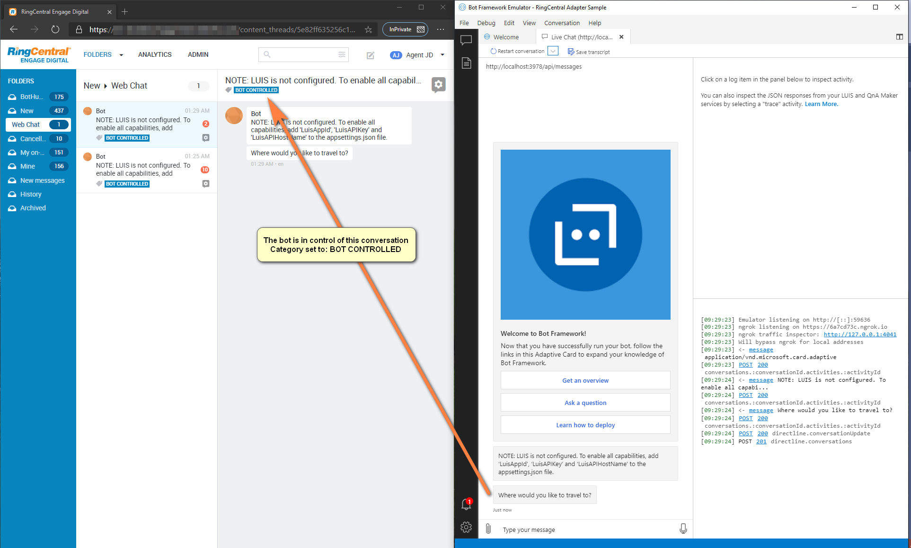
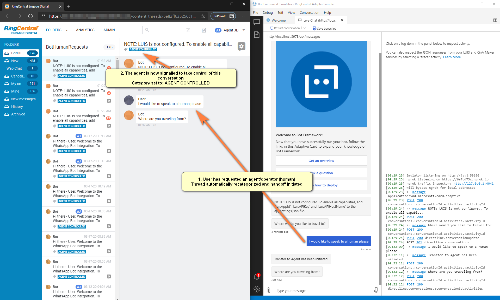
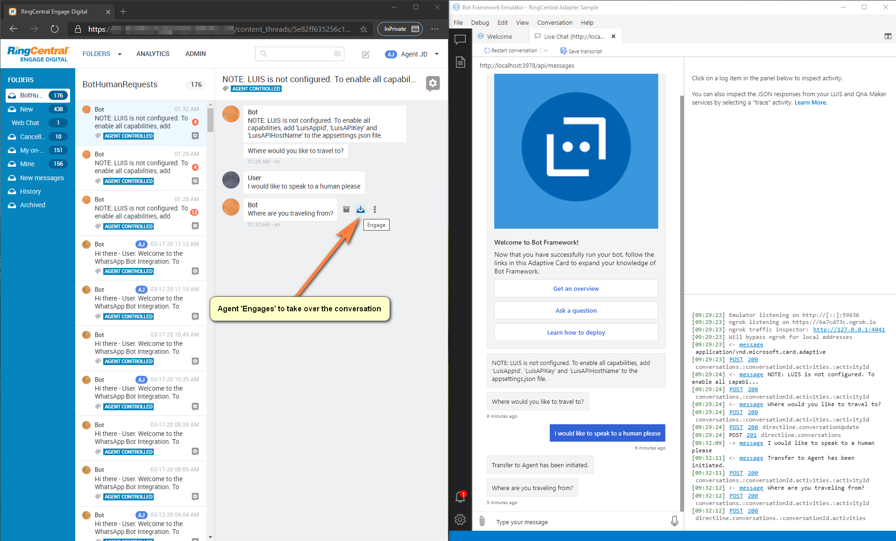
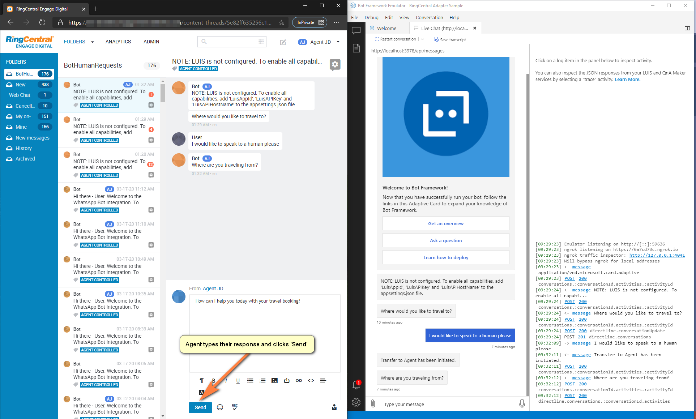
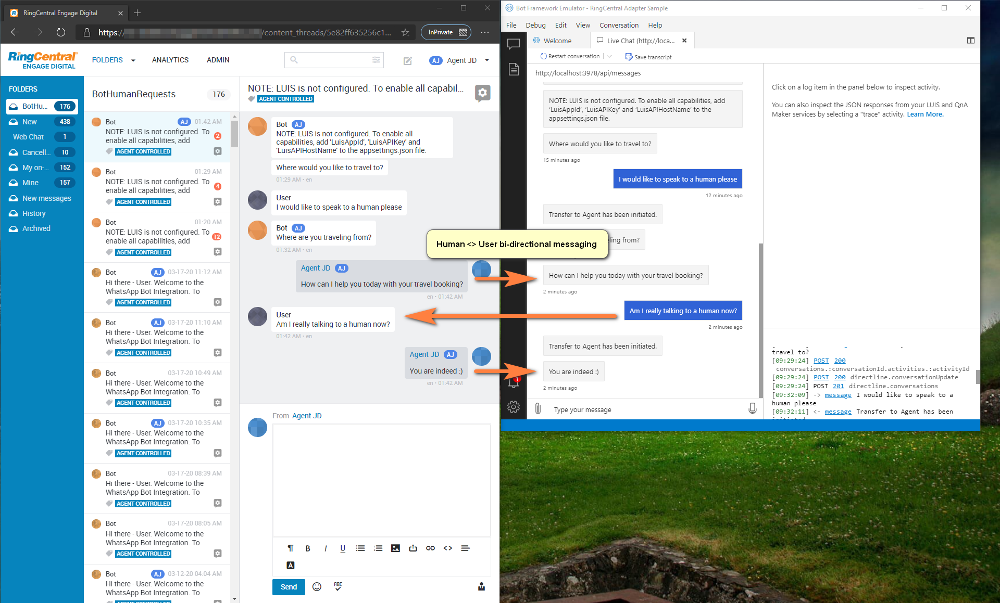
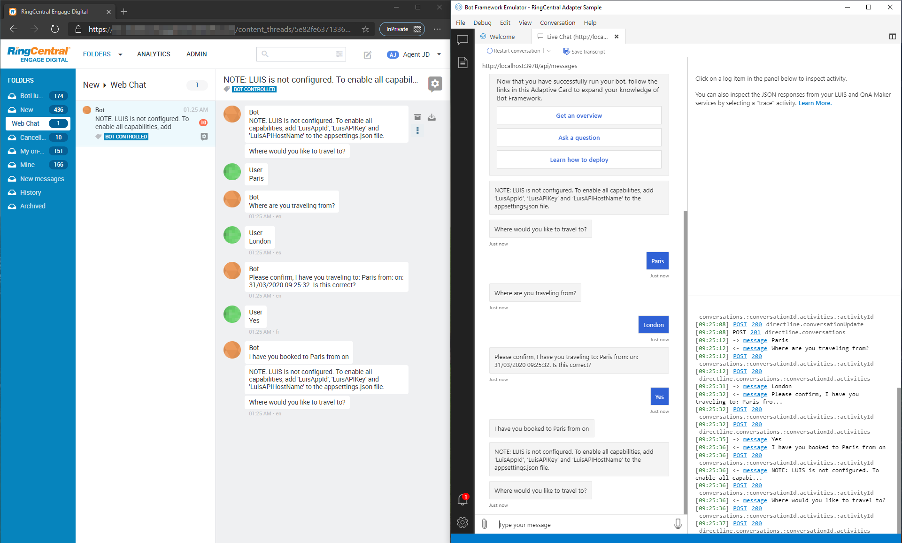

## RingCentral Engage Adapter for Bot Builder v4 .NET SDK

### Build status
| Branch | Status | Recommended NuGet package version |
| ------ | ------ | ------ |
| master | [](https://ci.appveyor.com/project/garypretty/botbuilder-community) | [](https://www.nuget.org/packages/Bot.Builder.Community.Adapters.RingCentral/) |

### Description

This is part of the [Bot Builder Community Extensions](https://github.com/garypretty/botbuilder-community) project which contains various pieces of middleware, recognizers and other components for use with the Bot Builder .NET SDK v4.

The [RingCentral](https://www.ringcentral.com/) Engage adapter allows you to add an additional endpoint to your bot for [RingCentral Engage Digital Platform](https://www.ringcentral.com/digital-customer-engagement.html) integration. The RingCentral endpoint can be used in conjunction with other channels meaning, for example, you can have a bot exposed on out of the box channels such as Facebook and Teams, but also integrated as an [RingCentral Engage Digital Source SDK](https://support.ringcentral.com/s/article/RingCentral-Engage-Digital-Introduction?language=en_US) into RingCentral.

All RingCentral Engage integration is achieved through the RingCentral API,  RingCentral webhooks and RingCentral Custom Source SDK.  The C# API support is provided through the [RingCentral Engage Community SDK](https://developers.ringcentral.com/engage/guide/sdks).  The Custom Source SDK and webhook configuration is described in the accompanying documentation.

Incoming RingCentral requests are transformed, by the adapter, into [Bot Framework Activity](https://docs.microsoft.com/en-us/dotnet/api/microsoft.bot.schema.activity?view=botbuilder-dotnet-stable) objects and then when your bot responds, the adapter transforms the outgoing Activity into a RingCentral response.

A basic sample bot is available [here](https://github.com/BotBuilderCommunity/botbuilder-community-dotnet/tree/master/samples/RingCentral%20Adapter%20Sample).

The adapter supports a broad range of capabilities from RingCentral, including;

* Support for RingCentral WhatsApp sources (digital social media channels)
  * Bi-directional communication between the WhatsApp user & the bot
  * Down-rendering bot messages to plain text
* Support for Human Handoff
  * Allow a bot user to request agent/operator (human) assistance
  * Allow a RingCentral operator/agent to intervene into the bot conversation
  * Bi-directional communication between the RingCentral operator and the bot user
* Activity Publishing Middleware to automatically log all bot conversations (transcripts) to the RingCentral platform

### Configuration

Depending on which features of this adapter you want to leverage, you'll need to configure your RingCentral Engage environment with the relevant Source, Source SDK and webhooks.  After this configuration, you will need to use specific RingCentral settings within your bot appSettings.json.  To make this easier to follow, the RingCentral Engage Digital  documentation has been split out into the following:

- [RingCentral Engage chatbot setup](./Docs/RingCentral/EngageChatbot.md)
- [RingCentral Engage WhatsApp configuration](./Docs/RingCentral/EngageWhatsApp.md)

### Installation

Available via NuGet package [Bot.Builder.Community.Adapters.RingCentral](https://www.nuget.org/packages/Bot.Builder.Community.Adapters.RingCentral/)

Install into your project using the following command in the package manager;
```
    PM> Install-Package Bot.Builder.Community.Adapters.RingCentral
```

### Sample

Basic sample bot available [here](../../samples/RingCentral%20Adapter%20Sample).

### Usage

* [Adding the RingCentral Adapter to your bot](#net-core-ringcentral-adapter)
	* [RingCentralController.cs](#ringcentralcontroller.cs)
    * [RingCentral Actions](#engage-digital-source-actions.cs)
    * [RingCentral Webhooks](#engage-digital-source-webhooks.cs)
    * [RingCentralAdapterWithErrorHandler.cs](#ringcentraladapterwitherrorhandler.cs)
    * [Startup class](#startup-class)
    * [Application Settings](#application-settings)
* [Human Handoff support](#human-handoff)
* [WhatsApp Channel Support](#whatsapp-channel-support)
    * [Custom Renderers](#custom-renderers)
    * [Startup configuration](#startup.cs)
* [Configuring RingCentral Engage Digital](#configuring-ringCentral-engage-digital)
* [Activity Publishing logging messages to RingCentral](#activity-publishing-(optional))
    * [Register ActivityPublishing middleware](#adapterwitherrorhandler.cs)

#### .NET Core RingCentral Adapter

First you'll need to create a MVC controller to provide an endpoint for your bot to receive webhooks and other events from the RingCentral platform.

##### RingCentralController.cs
```cs 
[HttpGet]
[HttpPost]
[Route("api/ringcentral/actions")]
public async Task Actions()
{
    await _adapter.ProcessAsync(Request, Response, _bot, default(CancellationToken));
}

[HttpGet]
[HttpPost]
[Route("api/ringcentral/webhooks")]
public async Task Webhooks()
{
    await _adapter.ProcessAsync(Request, Response, _bot, default(CancellationToken));
}
```
##### Engage Digital Source - Actions


##### Engage Digital Webhooks - Webhooks


Next, you'll need to create a RingCentralAdapter class.  Here you'll register any middleware and error handling that you need.

##### RingCentralAdapterWithErrorHandler.cs
```cs
public class RingCentralAdapterWithErrorHandler : RingCentralAdapter
{
    public RingCentralAdapterWithErrorHandler(
        IBotFrameworkHttpAdapter botAdapter,
        RingCentralClientWrapper ringCentralClient,
        DownRenderingMiddleware downRenderingMiddleware,
        IHandoffRequestRecognizer handoffRequestRecognizer,
        ILogger<RingCentralAdapter> logger) : base(ringCentralClient, botAdapter, handoffRequestRecognizer, logger)
    {
        _ = downRenderingMiddleware ?? throw new NullReferenceException(nameof(downRenderingMiddleware));

        // Downrender outbound messages processed by the adapter
        Use(downRenderingMiddleware);

        OnTurnError = async (turnContext, exception) =>
        {
            // Log any leaked exception from the application.
            logger.LogError(exception, $"[OnTurnError] unhandled error : {exception.Message}");

            // Send a message to the user
            await turnContext.SendActivityAsync("The bot encountered an error or bug.");
            await turnContext.SendActivityAsync("To continue to run this bot, please fix the bot source code.");

            // Send a trace activity, which will be displayed in the Bot Framework Emulator
            await turnContext.TraceActivityAsync("OnTurnError Trace", exception.Message, "https://www.botframework.com/schemas/error", "TurnError");
        };
    }
}
```
#### Startup Class

You can use the RingCentral adapter with your bot by registering the RingCentralAdapter.

##### Startup.cs
```cs
// Register configuration instances of option classes using "Options Pattern"
services.Configure<RingCentralOptions>(Configuration);

// Register RingCentral dependencies
services.AddRingCentral();

// Create the RingCentral adapter with error handling enabled
services.AddScoped<RingCentralAdapter, RingCentralAdapterWithErrorHandler>();
``` 

#### Application Settings

To fully configure the RingCentral adapter, you'll need to configure the following settings within appSettings.json.

##### appSettings.json
```json
// Bot name/handle from ABS
"BotId": "SampleBot",

// RingCentral Tenant API
"RingCentralEngageApiUrl": "https://[TENANT].api.engagement.dimelo.com/1.0",

// RingCentral Tenant API Access Token
"RingCentralEngageApiAccessToken": "000000000000000000000000",

// RingCentral Custom Source SDK Url
"RingCentralEngageCustomSourceRealtimeEndpointUrl": "https://[TENANT].engagement.dimelo.com/realtime/sdk/000000000000000000000000",

// RingCentral Custom Source SDK Access Token
"RingCentralEngageCustomSourceApiAccessToken": "0000000000000000000000000000000000000000000000000000000000000000",

// RingCentral Webhook Validation Token
"RingCentralEngageWebhookValidationToken": "00000000000000000000000000000000",

// RingCentral Category Id for bot led conversations
"RingCentralEngageBotControlledThreadCategoryId": "000000000000000000000000",

// RingCentral Category Id for agent led conversations
"RingCentralEngageAgentControlledThreadCategoryId": "000000000000000000000000",

// Bot activity publishing of all messages
"LogMessagesToRingCentral": "true"
```

#### Human handoff

During the bot conversation, at any point the user can request an agent/operator by asking for a 'human'.  This requires two RingCentral categories to be pre-configured:

* CategoryId: BOT CONTROLLED 
* CategoryId: AGENT CONTROLLED
 


 See the [RingCentral Engage chatbot setup](./Docs/RingCentral/EngageChatbot.md) for more details.

When the user requests a 'human' the following events take place:

* All bot messages are initially categorized to `BOT CONTROLLED` to signify that the bot framework bot is orchestrating the conversation.
* The user requests 'human' assistance.
* The bot initiates the human handoff process.
* The RingCentral Engage thread is re-categorized to `AGENT CONTROLLED`.  To signal to the RingCentral operator that there is a user that needs assistance.
* When the RingCentral operator 'Engages' (intervenes) in the conversation, any messages the operator sends to the user will automatically be routed through the RingCentral adapter to the bot user.  In addition, any replies the user gives will be directed to the RingCentral operator.
* When the RingCentral operator has 'Solved' the user issue/request, the RingCentrl Engage thread is re-categorized to `BOT CONTROLLED`.
* The bot will continue to orchestrate the conversation.







#### WhatsApp Channel Support

Any messages from the RingCentral WhatsApp Source can be routed through the Bot Framework, allowing the bot to service these user requests.  One important aspect to consider here is how to handle the different types of Bot Framework [Cards](https://github.com/Microsoft/botframework-sdk/blob/master/specs/botframework-activity/botframework-cards.md) that your bot may already be using.  WhatsApp does not (currently) support rich cards such as herocards, carousels, adaptive cards etc.  So you will need to plan how these should be down-rendered into plain text format.  

##### Custom Renderers

This adapter includes a basic [plain text renderer.cs](Renderer/PlainTextRenderer.cs) but you can override this based on your own custom rules by providing your own WhatsApp renderer implementation within the Startup.cs eg:

##### Startup.cs
```
// Register RingCentral dependencies.
services.AddRingCentral();

// (Optional) Register any custom WhatsApp Renderer
services.AddSingleton<IWhatsAppRenderer, CustomWhatsAppRenderer>();

// Create the RingCentral adapter with error handling enabled.
services.AddScoped<RingCentralAdapter, RingCentralAdapterWithErrorHandler>();
```

#### Configuring RingCentral Engage Digital
When you configure the RingCentral webhooks and source SDK it will immediately try to ping/healthcheck against the listener (bot) endpoints.  Therefore, you'll need to ensure that your bot is already up and running and that you've got ngrok running to expose the public endpoints.

You can test RingCentral is communicating to your newly configured API by adding a breakpoint into RingCentralController.cs `Actions` and `Webhooks` methods.  Then within the RingCentral Engage Custom Source or the Webhooks configuration, click on the Save button, this will fire an immediate healtcheck request that should get detected by the API.

#### Activity Publishing (optional)

You can optionally configure the adapter to publishing all bot messages from the user and the bot to RingCentral.  This is useful if you want to configure RingCentral as the single source of the truth for all end user logging/audit.  To enable this feature set the 'LogMessagesToRingCentral' flag to true within appSettings.json.  This is implemented as middleware and can be configured in the existing bot adapter.

##### AdapterWithErrorHandler.cs
```cs
public class AdapterWithErrorHandler : BotFrameworkHttpAdapter
{
    public AdapterWithErrorHandler(IConfiguration configuration,
        ILogger<BotFrameworkHttpAdapter> logger,
        ActivityPublishingMiddleware activityPublishingMiddleware,
        ConversationState conversationState = null)
        : base(configuration, logger)
    {
        Use(activityPublishingMiddleware);
...    
```



### Credits

This community project is the result of two targetted projects around RingCentral integration with the Bot Framework.  This code base has used many learnings, effort and contributions from the following engineers:

- [João Almeida](https://github.com/joalmeid)
- [Remi Bauby]()
- [Michael Brunner](https://github.com/michaelbrunner)
- [Jamie Dalton](https://github.com/daltskin)
- [Sven Frei](https://github.com/loubahnhof)
- [Cyrille Gourdin](https://github.com/Bacdol)
- [Artur Laksberg](https://github.com/arturl)
- [Luis Alves Martins](https://github.com/luisalvesmartins)
- [Shobhit Mishra]()
- [Egor Nikitin]()
- [Vishesh Oberoi](https://github.com/ovishesh)
- [Martin Oss](https://github.com/martinoss)
- [Martin Schray](https://github.com/mschray/)
- [Autumn Wyborny]()


