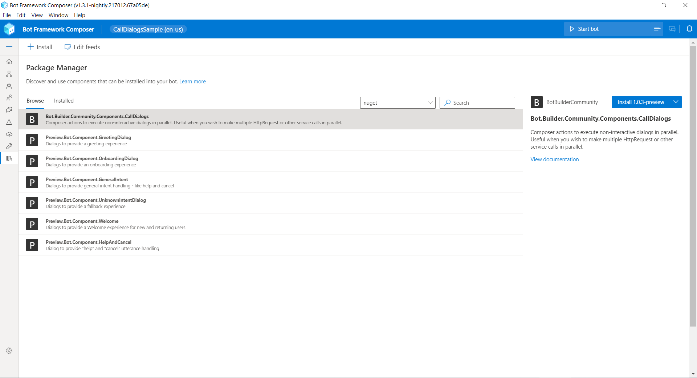
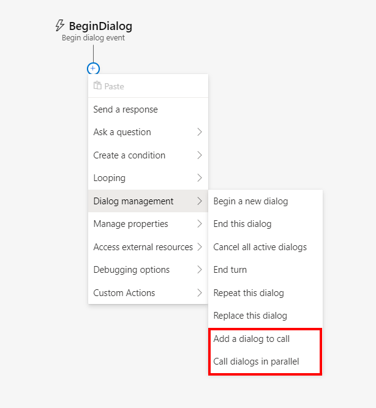
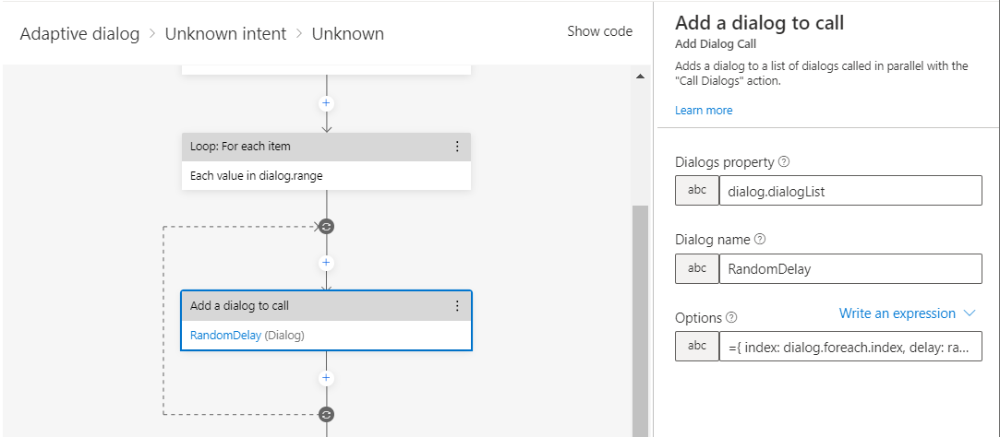
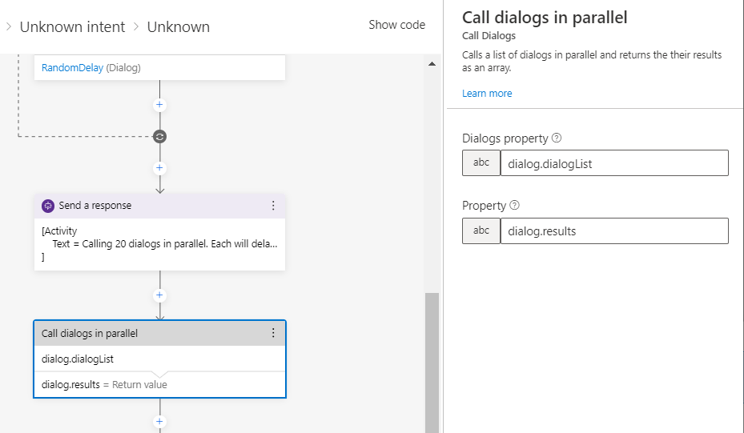

## CallDialogs Component for Bot Framework Composer

### Build status
| Branch | Status | Recommended NuGet package version |
| ------ | ------ | ------ |
| master |  |  |

### Description
This package extends [Bot Framework Composer](https://docs.microsoft.com/en-us/composer/introduction) with new actions for calling dialogs in parallel. Normally composer dialogs are executed in series one after the other. This is fine for the conversational elements of your bot but there may be times where you'd like to use something like the `HttpRequest` action to call multiple services at once. Using the [AddDialogCall](#AddDialogCall) action you can build up a list of dialogs to call in parallel using the [CallDialogs](#CallDialogs) action. 

> :warning: You should not call any dialogs in parallel that interact with the user. Sending activities is ok but do not call any input actions otherwise an error will be triggered.

The following new components are included in this package:

| Actions | Description |
| ------ | ------ |
| [AddDialogCall](#AddDialogCall) | Appends the name of a dialog to call, and any options, to a list. |
| [CallDialogs](#CallDialogs) | Calls a list of dialogs in parallel. |

A working [sample application](../../samples/components/CallDialogSample) is also available.

### Installation

This package can be installed from composers Package Manager screen. Just select the package from the list and click install.

### Usage

Once installed you should find two new actions added to composers "Dialog management" menu.

#### AddDialogCall

This action helps you build up the list of dialogs you want to call in parallel. You can call it from within a loop if all your calls or for the same dialog or stack them on top of each other if you want to execute different dialogs in parallel.  The actions takes as input the name of the property containing the list to append the call to (this property will be automatically initialized as an array on first call), the name of the dialog to call, and an optional set of options to pass the dialog.

#### CallDialogs

This action executes a list of dialogs in parallel.  It takes the name of the property containing the list of dialogs to execute and an optional property to receive an array of results returned by the called dialogs.  The dialogs being called can complete in an order but the order of the results array will always match the order of the dialogs list.

