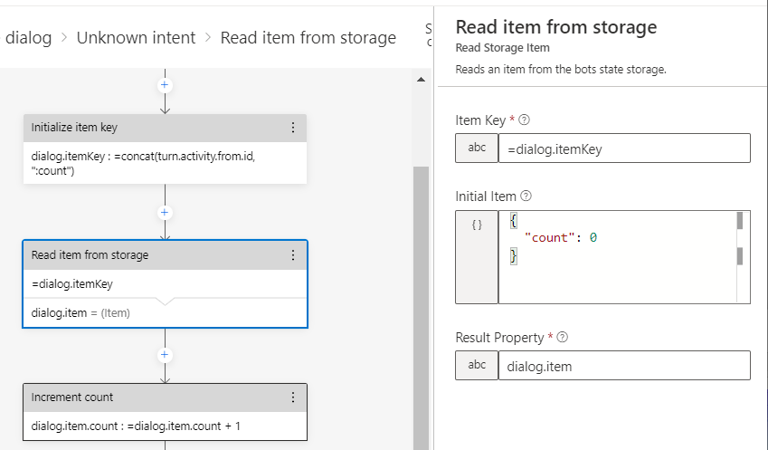

## CallDialogs Component for Bot Framework Composer

### Build status
| Branch | Status | Recommended NuGet package version |
| ------ | ------ | ------ |
| master |  |  |

### Description
This package extends [Bot Framework Composer](https://docs.microsoft.com/en-us/composer/introduction) with new actions for reading and writing items to the bots configured storage provider. Typically, items will be written to a memory based store when running locally and Cosmos DB when deployed to production. Items are standard JSON objects which, depending on the storage provider, may support concurrency via an `eTag` property.

The following new components are included in this package:

| Actions | Description |
| ------ | ------ |
| [ReadStorageItem](#ReadStorageItem) | Reads an item from storage. |
| [WriteStorageItem](#WriteStorageItem) | Writes an item to storage. |
| [DeleteStorageItem](#DeleteStorageItem) | Deletes an item previously written to storage. |

A working [sample application](../../samples/components/StorageSample) is also available.

### Installation

This package can be installed from composers Package Manager screen. Just select the package from the list and click install.

### Usage

Once installed you should find a new "Store items" menu off composers actions menu.

#### ReadStorageItem

This action will attempt to read an existing item from storage. Configure an `Item Key` and the `Result Property` for where to store the retrieved item.  You can optionally specify an `Initial Item` to return should an item with the specified key not be found. If not specified then `null` will be returned. 

Your `Item Key` can include the value from `turn.activity.from.id` to scope the item to the current user and/or `turn.activity.conversation.id` to scope the item to the current conversation.

#### WriteStorageItem

This action writes an item to storage. For storage providers that support concurrency, an `error` event will be raised if you attempt to save an existing object that's been changed by another conversation. Set `eTag = *` if you wish to always overwrite the existing item. 

#### DeleteStorageItem

This action will delete an existing item from storage. 

