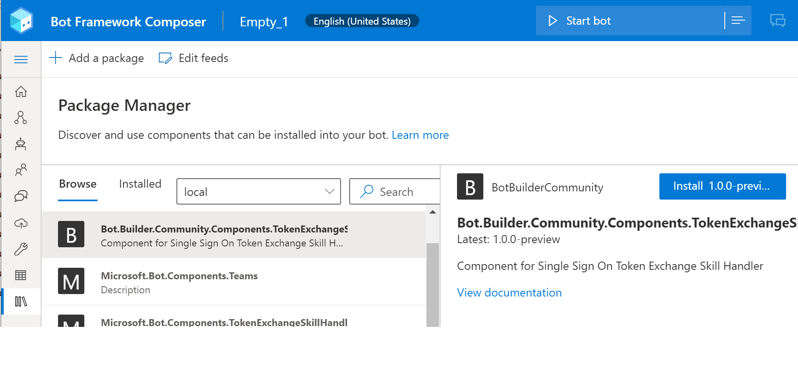

## Token Exchange Skill Handler for Composer and Adaptive Dialog Bots

### Build status
| Branch | Status | Recommended NuGet package version |
| ------ | ------ | ------ |
| master | [](https://ci.appveyor.com/project/garypretty/botbuilder-community) | [](https://www.nuget.org/packages/Bot.Builder.Community.Components.TokenExchangeSkillHandler/) |

### Description
This package extends [Bot Framework Composer](https://docs.microsoft.com/en-us/composer/introduction) with a CloudSkillHandler BotComponent for enabling Single Sign On Token Exchange between a root bot and skill bot. 

The following new component is in this package:

| Actions | Description |
| ------ | ------ |
| [TokenExchangeComponent](#TokenExchangeComponent) | Installs the TokenExchangeSkillHandler. |

### Installation

This package can be installed from composers Package Manager screen. Just select the package from the list and click install.



### Usage

Once installed you should find a Microsoft.Bot.Components.TokenExchangeSkillHandler in the Components section of the config. Ensure there is also a root level section titled "Microsoft.Bot.Components.TokenExchangeSkillHandler", with useTokenExchangeSkillHandler set to true and the proper Root Bot Oauth TokenExchangeConnectionName:

```json
    "components": [
      {
        "name": "Microsoft.Bot.Components.TokenExchangeSkillHandler",
        "settingsPrefix": "Microsoft.Bot.Components.TokenExchangeSkillHandler"
      }
    ],
	
	
	"Microsoft.Bot.Components.TokenExchangeSkillHandler": {
      "useTokenExchangeSkillHandler": true,
      "tokenExchangeConnectionName": ""
	},
  
```