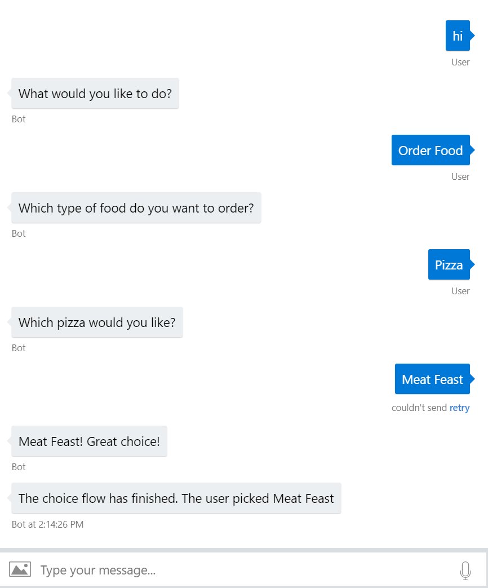

## ChoiceFlow for Bot Builder v4 .NET SDK

### Build status
| Branch | Status | Recommended NuGet package version |
| ------ | ------ | ------ |
| master | [](https://ci.appveyor.com/project/garypretty/botbuilder-community) | [](https://www.nuget.org/packages/Bot.Builder.Community.Dialogs.ChoiceFlow/) |

### Description
This is part of the [Bot Builder Community Extensions](https://github.com/garypretty/botbuilder-community) project which contains various pieces of middleware, recognizers and other components for use with the Bot Builder .NET SDK v4.

ChoiceFlow allows you to provide the user with a series of guided choice prompts in turn (defined in a JSON file or as a collection of ChoiceFlowItem objects), similar to when calling a telephone line with a series of automated options. You receive their last choice as a result from the dialog and optionally provide the user with a simple text response.
This could be used in conjunction with, or as an alternative to, using a natural language model.

If using the below tree as an example;

- Order Food
	- Pizza
		- Meat Feast
		- Cheese and Tomato
		- Ham and Pineapple
	- Bread
		- White
		- Wholemeal
- Get Opening Hours

1. Initially the user would be asked to choose between 'Order Food' and 'Get Opening Hours'. 
2. If the user picks 'Order Food' they would then be asked to choose between 'Pizza' and 'Bread'. 
3. Finally, if the user picked 'Pizza' they would then be asked to pick from the avaialble pizza choices and when they pick one of those final options the dialog would return that choice to you.



For each choice in the choice flow tree, you can define;

* **Id** (Required) - This is a number, which identifies the choice flow item (this should be unique for all items)
* **Name** (Required) - This is the text displayed to the user on the button when this choice is displayed within a set of choices
* **Synonyms** (Optional) - A series of synonyms that could be typed by the user to indicate they want to select this choice
* **Sub Choice Flow Items** (Optional) - A collection of choices to be offered to the user if they selected this item on their previous turn
* **Sub Choices Prompt** (Required if Sub choice flow items exist) - The text to display when prompting users after they have selected this item and they need to choose a sub choice
* **Sub Choices Retry Prompt** (Optional) - Prompt text to display if the user doesn't provide a valid choice
* **Simple Response** (Optional)- Final text displayed to the user if the selected item has no sub choices.

### Installation

Available via NuGet package [Bot.Builder.Community.Dialogs.ChoiceFlow](https://www.nuget.org/packages/Bot.Builder.Community.Dialogs.ChoiceFlow/)

Install into your project using the following command in the package manager;
```
    PM> Install-Package Bot.Builder.Community.Dialogs.ChoiceFlow
```

### Sample

A basic sample for using this component can be found [here](../../samples/ChoiceFlow%20Dialog%20Sample).

### Usage

To use the dialog, add it to your DialogSet. The example below shows the approach of passing in a ChoiceFlow in a JSON file. 
It also shows a IBotTelemetryClient being passed into in order for the dialogs telemetry being collected.

```cs

var pathToChoiceFlowJson = Path.Combine(Path.GetDirectoryName(Assembly.GetExecutingAssembly().Location), "choiceFlow.json");
Dialogs.Add(new ChoiceFlowDialog(pathToChoiceFlowJson));

```

Instead of passing a JSON file, you can manually build a list of ChoiceFlowItem and pass this into the constructor instead.

#### Defining your choice flow tree

You can define the initial choices, and each subsequent set of sub choices (displayed depending on the users previous response) in one of two ways;

* A JSON representation of the choice tree (see below for an example of ChoiceFlow JSON)
* Build up a collection of ChoiceFlowItem objects

#### ChoiceFlow JSON

Below is an example of the JSON required to define a ChoiceFlow. This includes examples of the various required and optional properties.

```json

[
  {
    "name": "Top",
    "prompt": "What would you like to do?",
    "id": 0,
    "choices": [
      {
        "name": "Order Food",
        "prompt": "Which type of food do you want to order?",
        "reprompt": "Which type of food do you want to order?",
        "id": 1,
        "choices": [
          {
            "name": "Pizza",
            "prompt": "Which pizza would you like?",
            "id": 10,
            "choices": [
              {
                "name": "Meat Feast",
                "synonyms": [ "meat", "meat pizza", "the meaty one" ],
                "id": 100,
                "choices": [],
                "simpleresponse": "Meat Feast! Great choice!"
              },
              {
                "name": "Cheese and Tomato",
                "id": 101,
                "choices": [],
                "simpleresponse": "Safe choice!"
              },
              {
                "name": "Ham and Pineapple",
                "id": 102,
                "choices": [],
                "simpleresponse": "Who likes pineapple?"
              }
            ]
          },
          {
            "name": "Bread",
            "id": 20,
            "choices": [
              {
                "name": "White",
                "id": 200,
                "choices": []
              },
              {
                "name": "Wholemeal",
                "id": 201,
                "choices": []
              }
            ]
          }
        ]
      },
      {
        "name": "Get Opening Hours",
        "synonyms": [ "hours", "opening times", "times" ],
        "id": 2,
        "choices": [],
        "simpleresponse": "Let me grab those hours for you..."
      },
      {
        "name": "Get In Touch",
        "id": 3,
        "choices": [],
        "simpleresponse": "You can contact us via email or telephone."
      }
    ]
  }
]

```

#### Calling the ChoiceFlow Dialog

In your bot code, when you want to hand off to a ChoiceFlow dialog you can use dc.Begin to do this, as shown in the below example using a Waterfall dialog. When returning, the dialog will return args of type ChoiceFlowItem, which will be the last choice selected by the user.

```cs

            Dialogs.Add(new WaterfallDialog("MainDialog", new WaterfallStep[]
            {
                async (dc, cancellationToken) =>
                {
                        return await dc.BeginDialogAsync(ChoiceFlowDialog.DefaultDialogId);
                },
                async (dc, cancellationToken) =>
                {
                    if (dc.Result is ChoiceFlowItem returnedItem)
                    {
                        await dc.Context.SendActivityAsync($"The choice flow has finished. The user picked {returnedItem.Name}");
                    }

                    return await dc.EndDialogAsync();
                }
            }));

```
